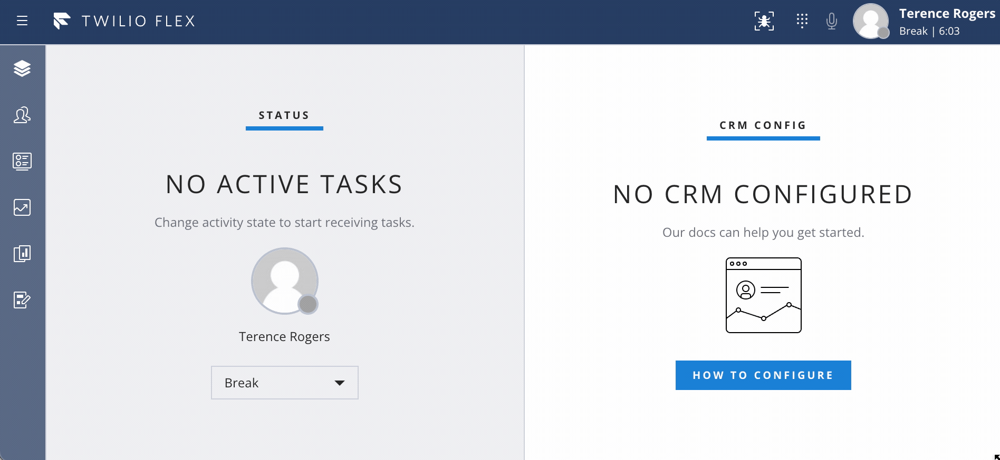

<a href="https://www.twilio.com">

</a>

# Twilio Flex Plugin - Auto Answer Task with Optional Audio Input Device Check

Twilio Flex Plugins allow you to customize the appearance and behavior of [Twilio Flex](https://www.twilio.com/flex). If you want to learn more about the capabilities and how to use the API, check out our [Flex documentation](https://www.twilio.com/docs/flex).

This plugin will automatically accept the incoming task and will alert the agent by playing a notification sound.

Sample demo is provided below :

Any incoming task will be accepted as shown below :


## Customize The Alert Sound

You can customize the sound played to the agent when a call connects through the use of the `.env` file. See the [.env.sample](https://github.com/twilio-professional-services/plugin-auto-answer-call/blob/main/.env.sample) file for instructions and an example alert sound.

## Audio Input Device Check

This plugin also includes the option of enabling an audio input device check for the following events:

* At Flex load, when the plugin initializes
* When a user tries to change into an `available: true` activity, such as "Available"
* On reservation created for voice tasks

In each of the above cases, if the audio device check fails, a notification is shown to the user letting them know there is a microphone issue which must be resolved. Here's a summary of the expected behavior for an audio device check failure for each of the above events:

* At Flex load, the user will be shown the notification
    * If an audio device error activity is configured, the user will be moved into that activity
    * If an audio device error activity is *not* configured, and the user is currently in an `available: true` activity, they will be moved to **Offline**
* When a user tries to change into an `available: true` activity, they will be shown the notification
    * If an audio device error activity is configured, the user will be moved into that activity
    * If an audio device error activity is *not* configured, and the user is currently in an `available: true` activity, they will be moved to **Offline**
    * If an audio device error activity is *not* configured, and the user is currently in an `available: false` activity, they will remain in their current activity
* On reservation created for voice tasks, the user will be shown the notification
    * If an audio device error activity is configured, the user will be moved into that activity
    * If an audio device error activity is *not* configured, and the user is currently in an `available: true` activity, they will be moved to **Offline**
    * The reservation will be rejected

Here's a demo of a user with disabled microphone permissions attempting to change into an `available: true` activity.



## Audio Input Device Check Configuration

To enable the audio input device check and configure an audio device error activity, we will use the [Flex Configuration API](https://www.twilio.com/docs/flex/developer/ui/configuration#modifying-configuration-for-flextwiliocom).

The following property will need to be added to the `ui_attributes` property of the Flex Configuration. Set `isDeviceCheckEnabled` to `true` and replace the value of `audioDeviceErrorActivitySid` with the SID of the activity users should be set to if the audio device check fails.

```json
"audioDeviceCheckPlugin": {
  "isDeviceCheckEnabled": true,
  "audioDeviceErrorActivitySid": "WAXXXXXXXXXXXXXXXXXXXXXXXXXXXXXXXX"
}
```

## Requirements

To deploy this plugin, you will need:

- An active Twilio account with Flex provisioned. Refer to the [Flex Quickstart](https://www.twilio.com/docs/flex/quickstart/flex-basics#sign-up-for-or-sign-in-to-twilio-and-create-a-new-flex-project") to create one.
- npm version 5.0.0 or later installed (type `npm -v` in your terminal to check)
- Node.js [long term support(LTS) version](https://nodejs.org/en/about/releases/)(type `node -v` in your terminal to check)

## Setup

Make sure you have [Node.js](https://nodejs.org) as well as [`npm`](https://npmjs.com) installed.

1.  Clone this repo:

```bash
https://github.com/twilio-professional-services/plugin-auto-answer-call.git
```

2. Go to the plugin directory

```bash
cd plugin-auto-answer-call
```

3. Install the dependencies

```bash
npm install
```

4. Run plugin on a local environment using Twilio CLI :

```bash
twilio flex:plugins:start
```

5. Deploy your plugin to your Flex project using Twilio CLI:

```bash
twilio flex:plugins:deploy --major --changelog "Notes for this version" --description "Functionality of the plugin"
```

More detailed information about deploying Flex plugins can be found here: https://www.twilio.com/docs/flex/developer/plugins/cli/deploy-and-release
