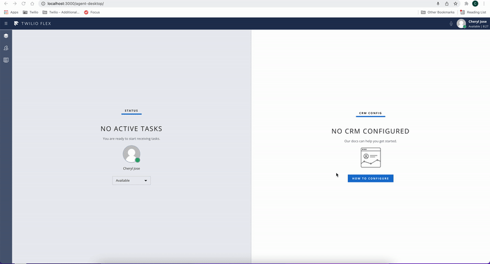

<a href="https://www.twilio.com">

</a>

# Twilio Flex Plugin - Auto answer task

Twilio Flex Plugins allow you to customize the appearance and behavior of [Twilio Flex](https://www.twilio.com/flex). If you want to learn more about the capabilities and how to use the API, check out our [Flex documentation](https://www.twilio.com/docs/flex).

This plugin will automatically accept the incoming task and will alert the agent by playing a notification sound.

Sample demo is provided below :

Any incoming task will be accepted as shown below :


## Customize The Alert Sound

You can customize the sound played to the agent through the use of the `.env` file. See the `.env.sample` file for instructions and an example alert sound.

## Requirements

To deploy this plugin, you will need:

- An active Twilio account with Flex provisioned. Refer to the [Flex Quickstart](https://www.twilio.com/docs/flex/quickstart/flex-basics#sign-up-for-or-sign-in-to-twilio-and-create-a-new-flex-project") to create one.
- npm version 5.0.0 or later installed (type `npm -v` in your terminal to check)
- Node.js [long term support(LTS) version](https://nodejs.org/en/about/releases/)(type `node -v` in your terminal to check)

## Setup

Make sure you have [Node.js](https://nodejs.org) as well as [`npm`](https://npmjs.com) installed.

1.  Clone this repo:

```bash
https://github.com/twilio-professional-services/plugin-auto-answer-call.git
```

2. Go to the plugin directory

```bash
cd plugin-auto-answer-call
```

3. Install the dependencies

```bash
npm install
```

4. Run plugin on a local environment using Twilio CLI :

```bash
twilio flex:plugins:start
```

5. Deploy your plugin to your Flex project using Twilio CLI:

```bash
twilio flex:plugins:deploy --major --changelog "Notes for this version" --description "Functionality of the plugin"
```

More detailed information about deploying Flex plugins can be found here: https://www.twilio.com/docs/flex/developer/plugins/cli/deploy-and-release
